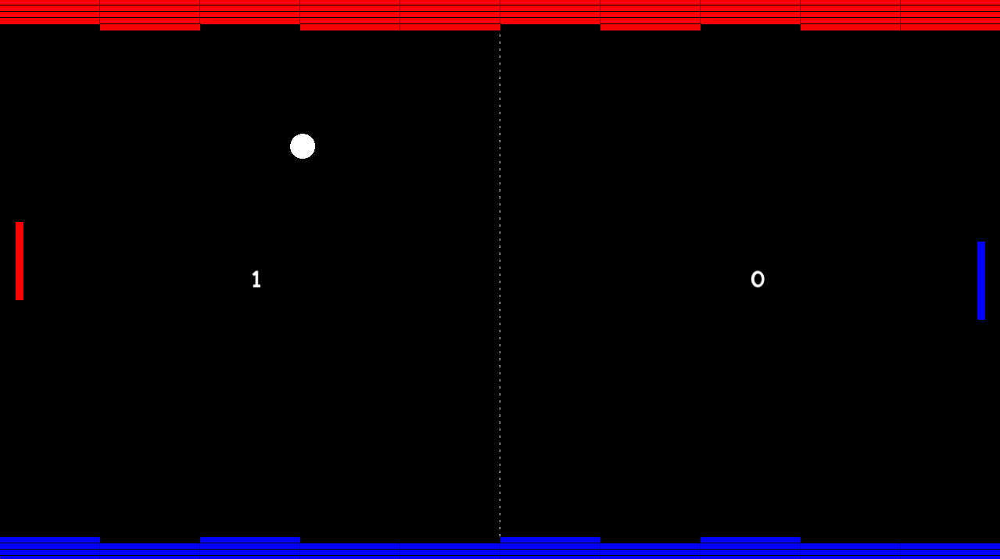

# Supercell Coding Test

</img>

# What changed?

I fixed up a good portion of code and made a cool side objective to the game. Whenever a player hits side of screen they get block to own side. The more blocks player owns, the faster the ball moves. Code I have written is in C style, so it was kind of hard to combine it with C++ structures. Overall, I think I worked pretty efficiently and all the aditions I made to the program are scalable and easy to read.

For controls use WASD. Have fun!

## How to generate project files

### Visual Studio 2022
One you have the project cloned to your PC.  Open a command prompt and from the source code directory run:
`cmake -B./build -G"Visual Studio 17 2022"`

Open `hive_test.sln` from `/build`

### Visual Studio 2019
One you have the project cloned to your PC.  Open a command prompt and from the source code directory run:
`cmake -B./build -G"Visual Studio 16 2019"`

Open `hive_test.sln` from `/build`

### XCode
One you have the project cloned to your MAC.  Open a terminal and from the source code directory run:
`cmake -B./build -GXcode`

Open `hive_test.xcodeproj` from `/build`
